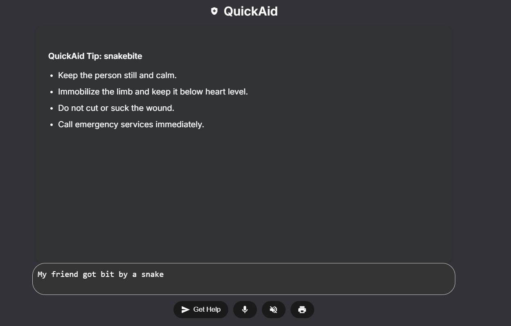

# QuickAid-A_firstAid_Assistant
# QuickAid – Your AI-Powered Emergency First Aid Assistant

QuickAid is a modern, offline-capable web assistant that delivers instant, accurate first-aid guidance based on user input. Designed for accessibility and reliability even without an internet connection it empowers users to act quickly and confidently in medical emergencies.

Built with HTML, CSS, JavaScript, and Web speech API (voice + speech) this project merges responsive UI, local data intelligence, and assistive technologies like speech recognition and text-to-speech.


``` It is designed as an AI-first web assistant, built with extensibility toward machine learning-based triage and conversational understanding. While the current implementation uses rule-based keyword matching for first aid scenarios, it’s structured to support future integration with models for intent recognition and symptom interpretation. ```


---

## Features

- 50+ Emergency Conditions with step-by-step local treatment
- Smart Keyword Matching via local `firstaid-data.json` 
- Voice Input Support using Web Speech API
- Text-to-Speech Guidance for accessibility
- Print-Ready Recommendations for documentation
- Modern Responsive UI styled like a real-world healthcare assistant
- Works fully offline after initial load (perfect for low-connectivity areas)

---

## Preview



> “My child has swallowed something!”  
> → QuickAid responds instantly with choking protocol for children.

---

## Tech Stack

| Layer         | Tech Used                          |
|---------------|------------------------------------|
| Core Logic    | HTML, CSS, JavaScript              |
| Accessibility | Web Speech API (voice + speech)    |
| UX/UI         | SweetAlert2 + Material Icons       |
| Data          | Custom `firstaid-data.json` (50+ conditions) |

---

## Project Structure
```bash
├── index.html
├── style.css
├── script.js
└── firstaid-data.json
```

## How It Works
- User types or speaks a medical emergency.
- The input is scanned against pre-defined keywords.
- If matched, QuickAid displays and reads out clean first-aid steps.
- If no match found, a fallback message is shown.

## Why QuickAid?
- Many regions lack reliable access to trained professionals or fast internet.
- Most emergencies don’t give you time to browse full websites or apps.
- QuickAid allows you to speak your emergency.
- It will also announce the results, and the precautions you could take to deal with the emergency at hand.

## Use cases
- Parents and caregivers handling child injuries
- Remote clinics and rural healthcare hubs
- Trekking/camping first aid kits with tablets


